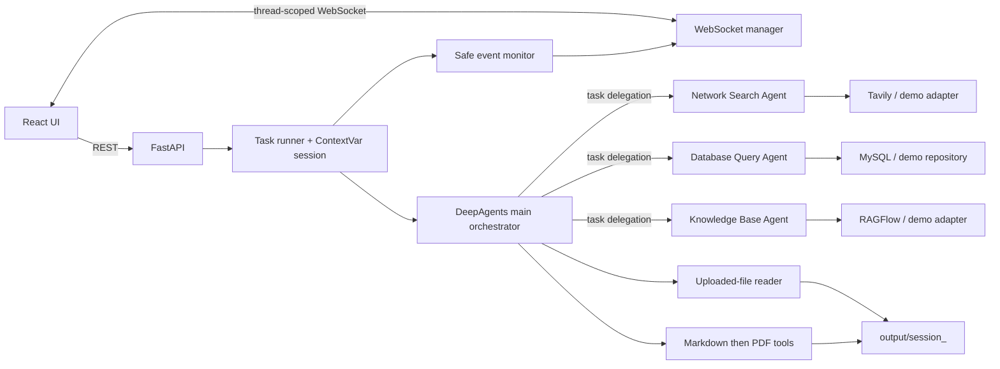

# Architecture

## System shape

DeepAgents Deep Research is a hierarchical orchestrator-workers system. The
main agent owns task planning, source routing, reflection, synthesis, uploaded
file reading, and report generation. It does not receive Tavily, MySQL, or
RAGFlow tools directly. Those capabilities remain inside specialist workers.



## Runtime sequence

1. The UI creates or restores a `thread_id`, connects `/ws/{thread_id}`, and
   optionally uploads one or more supported files.
2. `POST /api/task` validates the request and returns immediately after
   scheduling an asynchronous task.
3. The runner creates `output/session_<thread_id>`, copies that thread's
   uploads into it, binds `thread_id` and `session_dir` ContextVars, and emits
   `session_created`.
4. In Real Mode, `create_deep_agent` autonomously plans and delegates to the
   three configured subagents. In Demo Mode, a deterministic local research
   coordinator exercises the same routing, event, and file boundaries without
   external credentials. It is an explicit offline adapter, not a substitute
   for the Real Mode DeepAgents graph.
5. The monitor maps public execution metadata to `assistant_call`,
   `tool_start`, `task_result`, and `error`. Model reasoning is never emitted.
6. A runtime guard rejects evidence/report calls in the same model turn and
   enforces Markdown before PDF. Subgraph messages remain observable as tool
   activity, while only root-graph messages may become the final answer.
7. ContextVars are reset in `finally`, including cancellation and failure.

## Agent ownership

| Component | Responsibilities | Direct tools |
|---|---|---|
| Main Agent | plan, route, reflect, synthesize, generate requested output | `read_file_content`, `generate_markdown`, `convert_md_to_pdf` |
| Network Search Agent | decompose public research into 3-5 angles; retain citations | `internet_search` |
| Database Query Agent | discover schema, preview, execute read-only queries | `list_sql_tables`, `get_table_data`, `execute_sql_query` |
| Knowledge Base Agent | select an assistant and query at least three angles | `get_assistant_list`, `create_ask_delete` |

The main agent uses DeepAgents' native subagent configuration. A fixed DAG is
not used for Real Mode routing.

## Filesystem and isolation

```text
updated/session_<thread_id>/    temporary per-thread uploads
output/session_<thread_id>/     immutable scope for one running task
```

Thread identifiers accept a conservative character set and bounded length.
Uploads are copied, not shared, into the output session before execution.
Every file tool resolves a relative user/model path beneath the bound session,
rejecting absolute paths, drives, traversal (including URL-encoded variants),
and symlink escapes. Listing and download use a separate resolver constrained
to the `output/` root.

## Provider modes

- **Demo Mode (`DEMO_MODE=true`)**: no LLM, Tavily, RAGFlow, or external MySQL
  credential is required. Local adapters return meaningful sample research
  and company data and still exercise routing, monitoring, uploads, and report
  generation.
- **Real Mode (`DEMO_MODE=false`)**: an OpenAI-compatible chat endpoint powers
  DeepAgents. Tavily, MySQL, and RAGFlow are independently configured; each
  integration fails with a structured, user-visible error rather than
  preventing API startup.

## Trust boundaries

- Pydantic validates all HTTP input; filenames and thread IDs are sanitized.
- The SQL lexer permits only SELECT, SHOW, DESCRIBE/DESC, and EXPLAIN and
  rejects comments used for bypass and all multi-statement input.
- Provider clients have explicit timeouts and bounded result sizes.
- Structured logs redact secret-like fields and are separate from monitor
  messages.
- CORS is an explicit environment-controlled allowlist. Wildcard origins are
  never combined with credentials.
- Generated HTML is escaped/sanitized before PDF rendering. Markdown rendered
  by the UI is sanitized before insertion into the DOM.

## Deployment

Docker Compose defines frontend, backend, and MySQL services with healthchecks.
The default starts a credential-free Demo frontend/backend; MySQL belongs to
the opt-in `real` profile. Real Mode points the backend to configured external
or Compose services.
