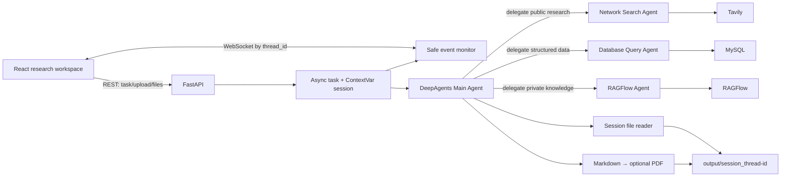

# DeepAgents Deep Research


DeepAgents Deep Research is an open-source, full-stack research workspace built
around a hierarchical DeepAgents orchestrator. A Main Agent plans and
synthesizes while three specialist agents handle public web research,
read-only business data, and private RAGFlow knowledge. Uploaded files and
generated Markdown/PDF reports remain isolated by task.

The repository is designed to be runnable without paid services in **Demo
Mode**, then switched to a real OpenAI-compatible LLM such as DeepSeek plus
Tavily, MySQL, and RAGFlow through environment variables.

> This is an independent, neutral open-source project. It is not an official
> product of, or endorsed by, any company referenced by its dependencies.

## Core features

- Native `create_deep_agent(...)` orchestration in Real Mode; no fixed DAG and
  no group-chat substitute.
- Exactly three bounded specialists: Network Search, Database Query, and
  RAGFlow Knowledge Base.
- Offline-first Demo Mode with meaningful local evidence and company data.
- Asynchronous FastAPI task API with thread-scoped WebSocket monitoring.
- Five safe event types without chain-of-thought disclosure.
- Multi-file upload and extraction for text, JSON, CSV, Word, PDF, and Excel.
- Markdown-first report generation and cross-platform PDF conversion.
- `ContextVar` task/session isolation and output-root download enforcement.
- AST-backed read-only SQL validation, bounded search, provider timeouts, and
  structured degradation.
- Original responsive React/TypeScript/Vite interface with reconnect,
  heartbeat, task history, Markdown rendering, and generated-file downloads.
- Pinned Python and npm dependencies, Docker Compose, and credential-free CI.

## Architecture



### Agent tool ownership

| Agent | Role | Direct tools |
|---|---|---|
| Main Agent | plan, route, reflect, synthesize, produce output | `read_file_content`, `generate_markdown`, `convert_md_to_pdf` |
| Network Search Agent | research 3–5 public-information angles | `internet_search` |
| Database Query Agent | discover schema, preview, run bounded read-only SQL | `list_sql_tables`, `get_table_data`, `execute_sql_query` |
| Knowledge Base Agent | select a RAGFlow assistant and query progressive angles | `get_assistant_list`, `create_ask_delete` |

Real Mode delegates autonomously through DeepAgents. Demo Mode is an explicit,
deterministic adapter that exercises the same routing, event, session, and file
boundaries without claiming to be an LLM.

## Technology

- Python 3.12, DeepAgents 0.7, LangChain/LangGraph, FastAPI, Pydantic
- Tavily, PyMySQL, RAGFlow SDK
- python-docx, pypdf, pandas, openpyxl/xlrd, ReportLab
- React 19, TypeScript 6, Vite 8, React Markdown, Vitest
- Docker Compose, Nginx, MySQL 8.4, GitHub Actions

## Repository layout

```text
agent/                 Main graph, runtime, prompts, and three subagents
api/                   REST, WebSocket, task lifecycle, monitor, logging
tools/                 Tavily, MySQL, RAGFlow, readers, Markdown, PDF
utils/                 Settings, path containment, input and SQL security
prompt/prompts.yml      All agent system prompts
sql/company_data.sql    Neutral reproducible MySQL sample data
ui/                    React/TypeScript/Vite application
tests/                 Unit and integration/security workflows
docs/                  Specification, API, deployment, and development docs
output/                Per-thread generated output (runtime sessions ignored)
updated/               Per-thread upload staging (runtime sessions ignored)
```

For design details, see [ARCHITECTURE.md](ARCHITECTURE.md). The normalized
requirements and source-material caveats are in
[docs/PROJECT_SPEC.md](docs/PROJECT_SPEC.md) and
[docs/REFERENCE_NOTES.md](docs/REFERENCE_NOTES.md).

## Quick start: Demo Mode

Requirements:

- Python 3.12
- Node.js 20.19 or newer and npm

Create a virtual environment and install the pinned backend dependencies:

```bash
python -m venv .venv
# Activate .venv using the command for your shell
python -m pip install -e ".[dev]"
```

Install and start the frontend:

```bash
cd ui
npm ci
npm run dev
```

In another terminal, from the repository root:

```bash
python -m uvicorn api.server:app --reload --host 127.0.0.1 --port 8000
```

Open `http://localhost:5173`. No `.env`, model key, Tavily account, database,
or RAGFlow server is needed for this path.

Try these prompts:

- `查询人工智能 Agent 最近的发展，并生成一份 Markdown 报告。`
- `分析数据库中的产品营收。`
- Upload a `.docx`, then ask `请总结上传的文档。`
- `综合公开趋势、数据库营收和知识库制度并生成 PDF 报告。`

Demo search results are visibly labelled local fixtures and must not be treated
as current internet evidence.

## Docker Compose

Demo Mode starts the frontend and backend without MySQL or credentials:

```bash
docker compose up --build
```

Open `http://localhost:5173`. To run the bundled MySQL service for Real Mode,
configure `.env` first, then use:

```bash
docker compose --profile real up --build
```

See [docs/DEPLOYMENT.md](docs/DEPLOYMENT.md) for profiles, healthchecks,
volumes, TLS, and retention guidance.

## Configuration

All secrets and provider settings are environment-only. Copy `.env.example` to
`.env` for local overrides; `.env` is ignored by Git.

| Variable | Default | Purpose |
|---|---|---|
| `DEMO_MODE` | `true` | Use local adapters; set `false` for the DeepAgents graph. |
| `LLM_MODEL` | `deepseek-v4-flash` | OpenAI-compatible chat model name. |
| `OPENAI_BASE_URL` | `https://api.deepseek.com` | OpenAI-compatible endpoint base. |
| `OPENAI_API_KEY` | empty | LLM credential required in Real Mode. |
| `LLM_TEMPERATURE` | `0.1` | Model sampling temperature. |
| `TAVILY_API_KEY` | empty | Live public-web research. |
| `MYSQL_HOST` / `MYSQL_PORT` | `localhost` / `3306` | Real structured-data endpoint. |
| `MYSQL_USER` / `MYSQL_PASSWORD` | `research` / empty | Real database login. |
| `MYSQL_DATABASE` | `company_data` | Database selected by the adapter. |
| `RAGFLOW_API_URL` / `RAGFLOW_API_KEY` | empty | Real private-knowledge service. |
| `CORS_ORIGINS` | `http://localhost:5173` | Comma-separated browser origin allowlist. |
| `EXTERNAL_TIMEOUT_SECONDS` | `20` | Provider/network operation timeout. |
| `MAX_UPLOAD_BYTES` | `10485760` | Per-file upload limit. |
| `MAX_UPLOAD_FILES` | `10` | Files accepted per upload request. |
| `MAX_EXTRACTED_CHARS` | `200000` | Maximum extracted characters per file. |
| `MAX_AGENT_STEPS` | `100` | Maximum LangGraph steps per research task. |
| `LOG_LEVEL` | `INFO` | Structured server log level. |

Frontend development overrides live in `ui/.env`:

```env
VITE_API_BASE_URL=http://localhost:8000
VITE_WS_BASE_URL=ws://localhost:8000
```

The production Nginx image uses same-origin `/health`, `/api`, and `/ws`
proxies when these build-time values are absent.

## Real Mode with DeepSeek

The project uses LangChain's OpenAI-compatible client, so DeepSeek is selected
entirely through environment variables:

```env
DEMO_MODE=false
LLM_MODEL=deepseek-v4-flash
OPENAI_BASE_URL=https://api.deepseek.com
OPENAI_API_KEY=<your-provider-key>
```

Set `LLM_MODEL=deepseek-v4-pro` when the higher-capability tier is preferred.
Confirm currently available identifiers with the
[official DeepSeek model endpoint documentation](https://api-docs.deepseek.com/api/list-models/)
before a production rollout.

Set the credential in your local `.env`, shell, CI secret store, or production
secret manager—never in source, tests, documentation, Compose YAML, or chat.
Rotate any credential that may previously have been exposed.

Real Mode constructs the Main Agent lazily on the first task. A missing LLM
credential therefore produces a task error rather than preventing FastAPI
from starting.

### Tavily

Set `TAVILY_API_KEY`. The Network Search Agent splits research into at least
three angles, supports `general`, `news`, and `finance`, preserves source
metadata, and enforces at most five search calls per task.

### MySQL

Set `MYSQL_HOST`, `MYSQL_PORT`, `MYSQL_USER`, `MYSQL_PASSWORD`, and
`MYSQL_DATABASE`. Use a database account that is independently read-only even
though the tool layer also permits only single `SELECT`, `SHOW`,
`DESCRIBE`/`DESC`, or `EXPLAIN` statements. `sql/company_data.sql` provides
neutral sample tables.

The Compose MySQL profile additionally requires non-empty
`MYSQL_ROOT_PASSWORD`; this value is consumed by the container and not by the
application.

### RAGFlow

Set `RAGFLOW_API_URL` and `RAGFLOW_API_KEY`. The specialist lists chat
assistants, selects one by name/description, creates an isolated temporary
session, asks up to five progressive questions, preserves references, and
deletes the session. Missing configuration, timeout, SDK failure, and cleanup
failure are normalized instead of crashing FastAPI.

## HTTP API examples

Start a task with a generated UUID:

```bash
curl -X POST http://localhost:8000/api/task \
  -H "Content-Type: application/json" \
  -d '{"query":"Research agent reliability practices"}'
```

Use a client-owned ID when uploading first:

```bash
curl -X POST http://localhost:8000/api/upload \
  -F "thread_id=research-001" \
  -F "files=@notes.md" \
  -F "files=@metrics.xlsx"

curl -X POST http://localhost:8000/api/task \
  -H "Content-Type: application/json" \
  -d '{"query":"Summarize the uploaded files","thread_id":"research-001"}'
```

List and download generated reports:

```bash
curl "http://localhost:8000/api/files?path=session_research-001"
curl -OJ "http://localhost:8000/api/download?path=session_research-001%2Fdeep-research-report.md"
```

Detailed contracts and error semantics are in
[docs/API.md](docs/API.md). Live OpenAPI is available at `/docs`.

## WebSocket event protocol

Connect to `ws://localhost:8000/ws/{thread_id}` before calling `/api/task`.
Each public event has:

```json
{
  "type": "monitor_event",
  "event": "tool_start",
  "message": "Running tool: internet_search",
  "data": {"tool_name": "internet_search", "args": {}},
  "timestamp": "2026-09-09T08:00:00+00:00"
}
```

Supported events:

- `session_created`: contains the output-relative session `path`.
- `assistant_call`: identifies Network Search, Database, or RAGFlow delegation.
- `tool_start`: identifies a safe tool name and public arguments.
- `task_result`: contains the final answer.
- `error`: contains a normalized task failure.

Send `ping` as a text frame for a `pong` response. The client reconnects with
bounded backoff, and the server replays recent events for that thread. Hidden
model reasoning is never sent.

## Report generation

When a prompt asks for Markdown, the Main Agent gathers evidence first and
then calls `generate_markdown`. When PDF is requested, it must generate the
Markdown source before `convert_md_to_pdf`. The writer rejects empty,
placeholder, and path-escaping requests. A Real Mode stream guard also rejects
evidence/report calls in the same turn and simultaneous Markdown/PDF calls.
ReportLab provides cross-platform PDF output using a built-in CJK font;
complex Markdown styling is intentionally rendered as a conservative document
layout.

Formal generated formats are Markdown and PDF. Word is supported as an input,
not an output.

## Security model

- Each task binds a validated `thread_id` and canonical `session_dir` with
  `ContextVar`; completion, cancellation, and failure reset the context.
- Upload and model-provided paths reject absolute paths, Windows drives,
  repeated URL-encoded traversal, symlinks escaping the session, and unsafe
  filenames/extensions.
- File listing/download can only reach regular files under `output/`.
- SQL is parsed and authorized in Python; mutating statements, comments,
  multi-statements, timing/file functions, and row overflow are rejected.
- Provider calls have timeouts and structured failures; searches, database
  rows, and agent graph steps are bounded.
- Console and rotating-file logs redact secret fields and token-like values.
- CORS is allowlisted; wildcard origin mode never enables credentials.
- UI Markdown does not enable raw HTML and external links use safe rel values.
- Runtime sessions, logs, `.env`, virtual environments, and frontend build
  artifacts are ignored by Git.

There is no built-in user authentication. Add an authenticated TLS gateway and
retention controls before exposing the service to untrusted users. See
[SECURITY.md](SECURITY.md).

## Testing

Backend:

```bash
python -m ruff check .
python -m mypy agent api tools utils
python -m pytest
python -m pytest --cov=agent --cov=api --cov=tools --cov=utils --cov-report=term-missing
```

Frontend:

```bash
cd ui
npm ci
npm run lint
npm run typecheck
npm test -- --run
npm run build
```

The test suite covers REST contracts, all five WebSocket monitor events,
ping/pong and disconnect, concurrent thread isolation, upload/path attacks,
read-only SQL, readers, Markdown/PDF, real agent construction with a fake
model, provider mocks/timeouts, and end-to-end Demo research workflows. CI
runs without real provider keys or cloud services.

## FAQ

### Why does Demo Mode not return live news?

It is intentionally credential-free and deterministic. Its sources are local
fixtures labelled `demo.local`. Set `DEMO_MODE=false` and configure both the
LLM and Tavily for current web research.

### Why did a task start but later report an error?

`POST /api/task` is asynchronous by contract. Provider, agent, and report
errors arrive through the thread WebSocket. Check the `error` event and
structured backend log without publishing secrets.

### Why can I not upload after starting a task?

Inputs are frozen into the output session before execution so concurrent work
cannot see a partially changed file set. Use a new thread ID or wait for the
current task to finish.

### Why is a SQL statement rejected even though it only reads?

Comments, multiple statements, file access, delay/lock functions, and
ambiguous/mutating AST nodes are rejected by design. Keep queries to one plain
read-only statement and grant the configured database user read-only access.

### Can I add another subagent?

Yes, but preserve least-privilege tool ownership and update prompts, monitor
mapping, architecture docs, tests, and the public UI label set. The current
contract deliberately defines exactly three specialists.

### Where are files stored?

Uploads stage in `updated/session_<thread_id>/`; execution copies them into
`output/session_<thread_id>/`, which also receives generated reports. Docker
uses named volumes for these roots.

## Roadmap

- Optional authentication and per-user authorization layer
- Durable task/event storage for multi-instance deployments
- Configurable object storage and retention policies
- Provider-level tracing/evaluation without private reasoning capture
- Broader Markdown-to-PDF layout support and accessibility checks
- Additional opt-in specialist adapters with the same least-privilege model

## Contributing

Read [CONTRIBUTING.md](CONTRIBUTING.md) and
[docs/DEVELOPMENT.md](docs/DEVELOPMENT.md). Security issues belong in private
vulnerability reporting, not public issues.

## License

Released under the [MIT License](LICENSE).
